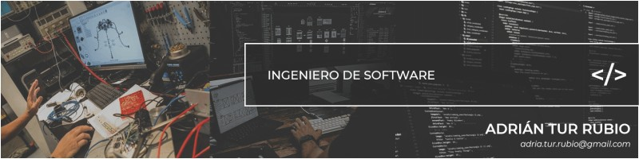

  

# ¡Hello World, soy Adrián Tur Rubio!

 

Soy un **Ingeniero de Software** y **Desarrollador Full-Stack** con un enfoque multidisciplinar que combina el rigor técnico con la creación de **soluciones digitales de alto impacto**. Mi metodología de trabajo se basa en tres pilares: **eficiencia técnica, calidad de código y diseño centrado en el usuario**. Me especializo en diseñar y construir soluciones tecnológicas robustas, con una alta capacidad para **integrar nuevas tecnologías** en sistemas funcionales y escalables. Creo firmemente que la ingeniería de calidad debe ir acompañada de interfaces excepcionales y una experiencia de usuario impecable. Me encuentro en un proceso de aprendizaje constante, entusiasmado por el dominio de nuevas tecnologías y por mi alta capacidad de adaptación para implementarlas con agilidad en cada proyecto

### Especializaciones:
- 💻 **Software Engineering & Full-Stack Development**
- 🤖 **Automatización & IA**
- 📱 **Web & Apps móviles**
- 🌐 **Internet of Things (IoT)**
- 🎮 **Videojuegos**
- 🎨 **Diseño UX/UI**

### Mi enfoque profesional:
- 🛠 **Calidad y Eficiencia:** Desarrollo de software profesional bajo buenas prácticas y arquitecturas escalables. 
- 🎨 **Estética y Funcionalidad:** Pasión por el diseño de interfaces (UI) de alto impacto y experiencias (UX) fluidas. 
- 🤖 **Integración Tecnológica:** Capacidad de adaptación y aplicación de vanguardia en IA, Robótica e IoT. 
- 📈 **Mentalidad Resolutiva:** Gran motivación por superar retos técnicos, aprendizaje continuo y búsqueda de soluciones eficaces.
 

## 🛠️ Stack Tecnológico

<table width="100%">
<tr>
<td>

### 🎯 Core Stack
*Las tecnologías que definen mi trabajo diario ey proyectos:*

  

</td>
</tr>
</table>

 

<table width="100%">
<tr>
<td>

### 🚀 All Stack

**Lenguajes:**
*Dominio de lenguajes para diversos entornos de desarrollo:*

  

**Frameworks:**
*Herramientas para la creación de aplicaciones:*

  

**Diseño UX/UI:**
*Especialización en interfaces visuales:*

  

**DevOps:**
*Gestión de infraestructuras, contenedores y control de versiones:*

  

**Herramientas:**
*Ecosistema de datos, hardware inteligente y entornos de desarrollo para sistemas conectados:*

  

**Otros:**
*Tecnologías complementarias que completan mi stack técnico:*

  
  
  
  

</td>
</tr>
</table>

 

## 📫 Conectemos

* 💼 **LinkedIn:** [linkedin.com/in/adrian-tur-rubio](https://www.linkedin.com/in/adrian-tur-rubio-469405279/) 
* 📧 **Email:** [adria.tur.rubio@gmail.com](mailto:adria.tur.rubio@gmail.com) 
* 📍 **Ubicación:** Comunitat Valenciana, España. 

 
